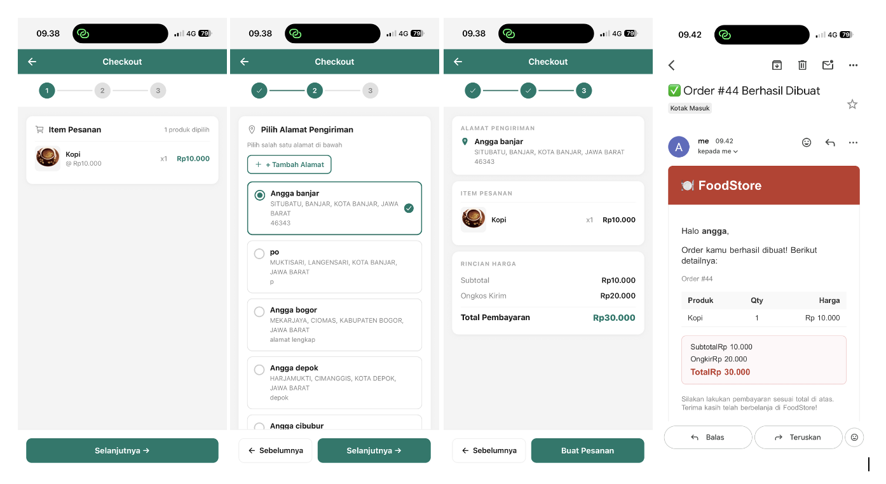
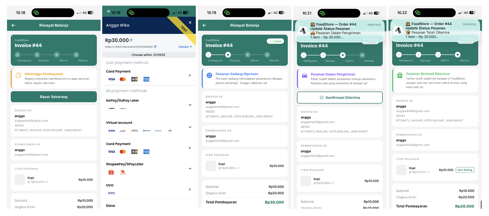

# Foodstore Mobile App

*Baca dalam bahasa lain: [English](README.md)*

Aplikasi mobile e-commerce makanan dengan fitur lengkap, dibangun dengan React Native (Expo SDK 54) dan TypeScript. Pengguna dapat menjelajahi produk makanan, mencari dengan riwayat pencarian, menambah ke keranjang, checkout dengan alamat pengiriman tersimpan, membayar via Midtrans Snap, melacak status pesanan, konfirmasi penerimaan, memberi ulasan produk yang dibeli, dan menyimpan produk favorit ke wishlist. Autentikasi mendukung email/password dan Google OAuth, dengan kunci biometrik (Face ID / sidik jari) setiap kali aplikasi dibuka. Menerima update status pesanan secara realtime melalui FCM push notification. Dibangun di atas backend REST API (Node.js + Express + MongoDB).

## Struktur Proyek

```
├── App.tsx                        # Entry point, BiometricGate, NavigationContainer
├── app.json                       # Konfigurasi Expo (plugin, permission)
└── src/
    ├── components/
    │   ├── ui/
    │   │   ├── Header.tsx         # Navbar (avatar, badge keranjang)
    │   │   └── Banner.tsx         # Carousel banner promo
    │   ├── product/
    │   │   └── ProductCard.tsx    # Kartu grid dengan toggle wishlist & rating
    │   ├── order/
    │   │   └── ReviewModal.tsx    # Bottom sheet untuk rating & komentar
    │   ├── address/
    │   │   ├── AddressFormModal.tsx
    │   │   └── RegionPicker.tsx   # Pemilih wilayah bertingkat
    │   ├── skeleton/
    │   │   ├── Skeleton.tsx       # Basis shimmer (Animated + LinearGradient)
    │   │   ├── ProductCardSkeleton.tsx
    │   │   ├── ProductDetailSkeleton.tsx
    │   │   └── OrderRowSkeleton.tsx
    │   └── OfflineBanner.tsx
    ├── screens/
    │   ├── auth/
    │   │   ├── LoginScreen.tsx
    │   │   ├── RegisterScreen.tsx
    │   │   ├── GoogleAuthScreen.tsx
    │   │   └── LockScreen.tsx     # Tampilan gerbang biometrik
    │   └── main/
    │       ├── HomeScreen.tsx     # Grid produk, pencarian, filter, infinite scroll
    │       ├── ProductDetailScreen.tsx
    │       ├── CartScreen.tsx
    │       ├── CheckoutScreen.tsx # Stepper 3 langkah
    │       ├── InvoiceScreen.tsx  # Status pesanan, WebView Midtrans, rating
    │       └── ProfileScreen.tsx  # Profil, riwayat pesanan, wishlist, alamat, tema
    ├── hooks/
    │   ├── useProducts.ts         # useInfiniteProducts
    │   ├── useOrders.ts           # useInfiniteOrders
    │   ├── useCart.ts
    │   ├── useWishlist.ts
    │   ├── useReviews.ts
    │   ├── useDeliveryAddresses.ts
    │   ├── useWilayah.ts
    │   ├── useUpdateAvatar.ts
    │   ├── usePushNotification.ts # FCM + listener notifikasi
    │   ├── useBiometricAuth.ts    # AppState + LocalAuthentication
    │   ├── useSearchHistory.ts    # Persist ke AsyncStorage
    │   ├── useTheme.ts
    │   ├── useGoogleAuth.ts
    │   └── useOfflineBanner.ts
    ├── store/
    │   ├── authStore.ts           # Zustand: user, token, loadAuth
    │   └── themeStore.ts          # Zustand: tema aktif
    ├── lib/
    │   ├── axios.ts               # Instance Axios + interceptor JWT
    │   ├── secureStorage.ts       # Wrapper expo-secure-store
    │   ├── snapHtml.ts            # Injector HTML Midtrans Snap
    │   └── utils.ts
    ├── constants/
    │   ├── themes.ts              # Token warna multi-tema
    │   └── colors.ts
    └── types/
        ├── navigation.ts
        ├── product.ts
        ├── cart.ts
        ├── order.ts
        ├── address.ts
        ├── review.ts
        └── wishlist.ts
```

## Tech Stack

| Kategori | Library |
|---|---|
| Framework | Expo SDK 54 + TypeScript |
| Navigasi | React Navigation (Native Stack) |
| HTTP Client | Axios + interceptor JWT |
| Server State | TanStack Query (cache, refetch, mutation) |
| UI State | Zustand (auth, tema) |
| Form | React Hook Form + Zod |
| Penyimpanan | expo-secure-store (native) / localStorage (web) |
| Pencarian | use-debounce |

## Backend

Base URL: `https://foodstore-server-nu.vercel.app`

### 🚧 Segera Hadir

**Auth**

- [ ] Layar verifikasi OTP — ketika login mengembalikan error "email belum terverifikasi", tampilkan layar input PIN 6 digit yang dikirim ke email; endpoint: `POST /auth/mobile/send-otp` + `POST /auth/mobile/verify-otp` (terpisah dari alur web yang memakai klik link)
- [ ] Google Sign-In native (`@react-native-google-signin/google-signin`) — alur OAuth native, butuh endpoint backend baru `POST /auth/google/mobile`

**UI**

- [ ] Dark mode — sistem tema sudah tersedia, tinggal menambah varian `dark` per token warna

## Fitur

### ✅ Selesai

**Auth**

| Login | Register |
|-------|----------|
|  |  |

- [x] Login (email + password)
- [x] Register
- [x] Auto login — cek token saat aplikasi dibuka, redirect otomatis
- [x] Logout
- [x] Mode tamu — halaman home bisa diakses tanpa login
- [x] Autentikasi biometrik (`expo-local-authentication`) — sidik jari / Face ID setiap aplikasi dibuka dan kembali dari background (`AppState`); cache tetap utuh, hanya gerbang auth yang direset

**Alur Login**

```
User memasukkan email + password
          |
          ▼
    POST /auth/login
          |
          ├─→ Email tidak ditemukan       → error "Email atau password salah"
          |
          ├─→ Password salah              → error "Email atau password salah"
          |
          ├─→ Akun belum terverifikasi    → email verifikasi dan OTP (segera hadir)
          |
          └─→ Valid & terverifikasi
                    |
                    ▼
              Generate token JWT
              Simpan token ke DB (array tokens[])
              Return { user, token }
                    |
                    ▼
              Simpan token ke SecureStore
              Set user di Zustand store
              Redirect ke Home
```

**Alur Register**

```
User mengisi nama + email + password
          |
          ▼
   POST /auth/register
          |
          ├─→ Email sudah dipakai         → error "Email sudah terdaftar"
          |
          └─→ Berhasil
                    |
                    ▼
              Buat user baru di DB
              Kirim email verifikasi (Nodemailer)
              Return { message: "registered" }
                    |
                    ▼
              Alert "Akun dibuat. Cek email untuk verifikasi."
                    |
                    ▼ (tap OK)
              Navigasi ke Login
```

**Home**

| Sudah Login | Tamu |
|-------|-------|
|  |  |

- [x] Daftar produk (grid 2 kolom)
- [x] Pencarian produk dengan debounce (500ms)
- [x] Filter kategori
- [x] Filter tag (multi-select)
- [x] Carousel banner
- [x] Header dengan badge keranjang + avatar user
- [x] Badge "Sisa n" di kartu produk saat stok ≤ 5
- [x] Tombol "+" di kartu produk dinonaktifkan saat qty keranjang mencapai batas stok

```
Buka HomeScreen
          |
          ▼
  GET /api/products (limit: 5, skip: 0)   ← useInfiniteProducts
  GET /api/categories                      ← useCategories
  GET /api/tags                            ← useTags
  GET /api/wishlists                       ← useWishlist (dilewati jika tamu)
          |
          ▼
  isLoading → tampilkan skeleton (3 baris × 2 kartu)
          |
          ▼
  Tampilkan grid produk 2 kolom + carousel banner
          |
          ├─→ Pencarian (debounce 500ms)
          │         |
          │         ├─→ fokus + kosong + ada riwayat → tampilkan panel Riwayat Pencarian
          │         │         |
          │         │         └─→ tap item → isi kolom pencarian + tutup keyboard
          │         |
          │         └─→ ketik → GET /api/products?q=... (refetch otomatis)
          |
          ├─→ Filter kategori (tap chip)
          │         └─→ GET /api/products?category=...
          |
          ├─→ Filter tag (chip multi-select)
          │         └─→ GET /api/products?tags=...
          |
          ├─→ Scroll ke bawah (onEndReached threshold 0.3)
          │         └─→ hasNextPage → GET /api/products?skip=5 (infinite scroll)
          |
          ├─→ Tap kartu produk → navigasi ProductDetail
          |
          ├─→ Tap hati (wishlist)
          │         ├─→ Tamu → (tidak ada aksi, hati tidak ditampilkan)
          │         ├─→ Sudah di wishlist → DELETE /api/wishlists/:product_id
          │         └─→ Belum di wishlist → POST /api/wishlists { product_id }
          |
          ├─→ Tap ikon keranjang
          │         ├─→ Sudah login → navigasi Cart
          │         └─→ Tamu → navigasi Login
          |
          └─→ Tap avatar / ikon profil → navigasi Profile
```

**Keranjang**


- [x] Tambah ke keranjang (tamu → diarahkan ke login)
- [x] Jumlah badge keranjang di header (realtime)
- [x] Ikon keranjang loading selama mutation berjalan
- [x] Empty state saat keranjang kosong
- [x] Checkbox per item + Pilih Semua
- [x] Hapus item terpilih lewat tombol "Hapus"
- [x] Ikon tempat sampah per item — hapus satu item langsung
- [x] Ubah qty; qty → 0 otomatis menghapus item dari keranjang
- [x] Subtotal per item ditampilkan di kanan tiap kartu
- [x] Kartu item dinonaktifkan (opacity 0.6) selama mutation berjalan
- [x] Ringkasan pesanan (subtotal + ongkir Rp 20.000 + total) — hanya muncul jika ada item tercentang
- [x] Tombol "Beli (n)" — hanya muncul jika ada item tercentang, hanya mengirim item `checked = true` ke Checkout

```
Buka CartScreen
          |
          ▼
  GET /api/cart                            ← useCart
          |
          ▼
  isLoading → tampilkan spinner
          |
          ├─→ Keranjang kosong → tampilkan empty state (ikon keranjang + pesan)
          |
          └─→ Tampilkan daftar item
                    |
                    ├─→ Tap checkbox (per item)
                    │         └─→ PUT /api/cart (toggle checked)
                    |
                    ├─→ Tap "Pilih Semua"
                    │         └─→ PUT /api/cart (set semua checked = true/false)
                    |
                    ├─→ Tap "Hapus" (massal)
                    │         └─→ PUT /api/cart (hapus semua item tercentang)
                    |
                    ├─→ Tap ikon tempat sampah (per item)
                    │         └─→ PUT /api/cart (hapus item tersebut)
                    |
                    ├─→ Tap qty "−"
                    │         ├─→ qty > 1 → PUT /api/cart (qty - 1)
                    │         └─→ qty = 1 → PUT /api/cart (hapus item)
                    |
                    ├─→ Tap qty "+"
                    │         └─→ PUT /api/cart (qty + 1)
                    |
                    └─→ Ada item tercentang → tampilkan Ringkasan Pesanan
                                  subtotal + ongkir (Rp 20.000) + total
                                        |
                                        ▼
                              Tap "Beli (n)" → navigasi Checkout
                              (hanya mengirim item checked = true)
```

**Checkout**



- [x] Alur checkout 3 langkah dengan UI stepper
- [x] Langkah 1: Tinjau item pesanan — hanya item `checked = true` dari keranjang
- [x] Langkah 2: Pilih alamat pengiriman dari alamat tersimpan (dengan radio select)
- [x] Langkah 3: Konfirmasi — ringkasan alamat, item, subtotal, ongkir (Rp 20.000), dan total pembayaran
- [x] Buat pesanan via `POST /api/orders` → langsung navigasi ke InvoiceScreen

```
Navigasi ke CheckoutScreen
(menerima hanya item checked = true dari keranjang)
          |
          ▼
  ┌─────────────────────────────────────────┐
  │  Stepper:  [1] ──── [2] ──── [3]       │
  └─────────────────────────────────────────┘
          |
          ▼
  LANGKAH 1 — Tinjau Item Pesanan
  Tampilkan daftar item tercentang (gambar, nama, qty, subtotal)
          |
          ▼ (tap Lanjut →)
  LANGKAH 2 — Pilih Alamat Pengiriman
  GET /api/delivery-addresses               ← useDeliveryAddresses
          |
          ├─→ Loading → tampilkan spinner
          ├─→ Tap kartu alamat → pilih (highlight radio button)
          └─→ Belum ada alamat dipilih → tombol "Lanjut" dinonaktifkan
          |
          ▼ (tap Lanjut → , alamat sudah dipilih)
  LANGKAH 3 — Konfirmasi
  Tampilkan: alamat pengiriman + item pesanan + rincian harga
        subtotal + ongkir (Rp 20.000) + total pembayaran
          |
          ▼ (tap "Buat Pesanan")
  POST /api/orders { delivery_fee, delivery_address }
          |
          ├─→ Error → Alert "Gagal membuat pesanan, coba lagi"
          |
          └─→ Berhasil
                    |
                    ▼
              Backend: decode JWT → ambil email user dari DB
              Backend: kirim email konfirmasi pesanan (Nodemailer)
                       → ke: email user
                       → isi: ringkasan pesanan, item, total, alamat pengiriman
                    |
                    ▼
              navigation.replace('Invoice', { orderId, fromCheckout: true })
```

**Invoice & Pembayaran**



- [x] Kartu invoice — nomor invoice, badge status (Lunas), stepper 4 langkah (Pembayaran → Diproses → Dikirim → Diterima)
- [x] Banner status per kondisi: Menunggu Pembayaran, Terkonfirmasi, Diproses, Dalam Pengiriman, Diterima, Gagal
- [x] Tombol "Bayar Sekarang" saat status `waiting_payment`
- [x] Popup Midtrans Snap via WebView (inject Snap.js sandbox) — dipicu dari InvoiceScreen
- [x] Callback Snap.js via `postMessage`: `success`, `pending`, `error`, `close`
- [x] Verifikasi pembayaran via `GET /api/payments/verify/:order_id` setelah sukses
- [x] Tombol "Konfirmasi Diterima" saat status `in_delivery`
- [x] Tombol "Beri Ulasan" per item saat status `delivered`
- [x] Info pengiriman (alamat), info pembayaran (nama + email user), item pesanan, ringkasan harga

```
Buka InvoiceScreen (orderId)
          |
          ▼
  GET /api/orders/:orderId              ← useOrder
  GET /api/reviews?order_id=...         ← useReviews (cek item yang sudah diulas)
          |
          ▼
  Tampilkan Kartu Invoice
  - Nomor invoice, badge "Lunas" (jika bukan menunggu/gagal)
  - Stepper progres 4 langkah: Pembayaran → Diproses → Dikirim → Diterima
  - Banner status dengan ikon + pesan
          |
          ├─→ status: waiting_payment
          │         |
          │         ▼
          │   Tap "Bayar Sekarang"
          │         |
          │         ▼
          │   POST /api/payments/token/:orderId   → dapat snap_token
          │         |
          │         ▼
          │   Buka Modal Midtrans (WebView + Snap.js)
          │         |
          │         ├─→ success / pending → tutup modal
          │         │         └─→ GET /api/payments/verify/:orderId
          │         │                   → update status pesanan di DB
          │         │                   → refetch order (invalidate TanStack Query)
          │         ├─→ error  → tutup modal + Alert "Pembayaran gagal"
          │         └─→ close  → tutup modal (tanpa aksi)
          |
          ├─→ status: payment_confirmed → banner "Pembayaran Terkonfirmasi"
          ├─→ status: processing        → banner "Pesanan Sedang Diproses"
          |
          ├─→ status: in_delivery
          │         |
          │         ▼
          │   Tampilkan tombol "Konfirmasi Diterima"
          │   Tap → Alert dialog konfirmasi
          │         └─→ konfirmasi → PUT /api/orders/:orderId/confirm-delivery
          │                         → status berubah menjadi "delivered"
          |
          └─→ status: delivered
                    |
                    ▼
              Tampilkan tombol "Beri Ulasan" per item (jika belum diulas)
              Tap → buka ReviewModal (rating bintang + komentar)
                    |
                    └─→ POST /api/reviews { product_id, order_id, rating, comment }
                              → tombol hilang untuk item tersebut
                              → daftar ulasan tampil di bawah item
```

**Realtime & Notifikasi**

- [x] FCM push notification — update status pesanan dikirim dari backend via `firebase-admin`, diterima saat foreground (`setNotificationHandler`), background, dan terminated (`getLastNotificationResponseAsync`); tap notifikasi langsung membuka InvoiceScreen

```
Aplikasi dibuka (user sudah login)
          |
          ▼
  Cek Device.isDevice
          |
          ├─→ simulator / bukan perangkat → lewati registrasi FCM
          |
          └─→ perangkat asli
                    |
                    ▼
              getPermissionsAsync()
                    |
                    ├─→ sudah diizinkan → lanjut
                    |
                    └─→ belum diizinkan → requestPermissionsAsync()
                                  |
                                  ├─→ ditolak → lewati registrasi
                                  |
                                  └─→ diizinkan
                                            |
                                            ▼
                                    getExpoPushTokenAsync({ projectId })
                                            |
                                            ▼
                                    PUT /api/users/mobile/fcm-token
                                    { fcm_token: "<expo-push-token>" }

─────────────────────────────────────────────────────────

Backend mengirim update status pesanan
          |
          ▼
  firebase-admin → FCM → perangkat

          ┌─────────────────────────────┐
          │  Status app saat diterima   │
          └─────────────────────────────┘
                    |
          ┌─────────┼──────────────────┐
          ▼         ▼                  ▼
      Foreground  Background        Terminated
          |           |                 |
          ▼           ▼                 ▼
  setNotification  system tray     system tray
  Handler tampil   notifikasi      notifikasi
  alert in-app
          |           |                 |
          ▼           └────────┬────────┘
  invalidateQueries            |
  ['orders', orderId]          ▼
  ['orders']           user tap notifikasi
                               |
                               ▼
                    addNotificationResponse
                    ReceivedListener terpicu
                    (atau useLastNotification
                     Response saat cold start)
                               |
                               ▼
                    navigate('Invoice', { orderId })
                    (retry tiap 100ms sampai
                     navigationRef.isReady())
```

**Profil**


- [x] Info pribadi (nama, email, role, ID pelanggan, indikator login Google)
- [x] Ganti tema warna (Green Fern, Green Jade, Red, Blue, Orange)

```
Buka ProfileScreen
          |
          ▼
  Tampilkan hero: avatar, nama, email, Customer #n
  Tab bar horizontal: Biodata | Alamat | Riwayat | Favorit | Keamanan | Logout
          |
          ├─── Tab: Biodata Diri ────────────────────────────────────────────
          │         |
          │         ▼
          │   Tampilkan: Nama Lengkap, Email (+ badge terverifikasi/belum),
          │         Role, ID Pelanggan, indikator login Google
          │
          ├─── Tab: Alamat Pengiriman ───────────────────────────────────────
          │         |
          │         ▼
          │   GET /api/delivery-addresses   ← useDeliveryAddresses
          │         |
          │         ├─→ isLoading → ActivityIndicator
          │         ├─→ kosong → "Belum ada alamat tersimpan"
          │         └─→ daftar alamat (nama, wilayah, detail)
          │                   ├─→ tap pensil → AddressFormModal (edit)
          │                   │         PUT /api/delivery-addresses/:id
          │                   ├─→ tap tempat sampah → Alert konfirmasi
          │                   │         DELETE /api/delivery-addresses/:id
          │                   └─→ tap "Tambah" → AddressFormModal (buat baru)
          │                             POST /api/delivery-addresses
          │
          ├─── Tab: Riwayat Belanja ─────────────────────────────────────────
          │         |
          │         ▼
          │   GET /api/orders (infinite scroll)   ← useInfiniteOrders
          │         |
          │         ├─→ isLoading → OrderRowSkeleton × 4
          │         ├─→ pesanan waiting_payment > 0
          │         │         → banner kuning "n pesanan menunggu pembayaran"
          │         │         → tap banner → buka/tutup daftar pesanan
          │         │         → tap pesanan → navigate('Invoice', { orderId })
          │         └─→ daftar pesanan (nomor, tanggal, total, badge status)
          │                   → scroll mendekati bawah → fetchNextPage
          │                   → tap baris → navigate('Invoice', { orderId })
          │
          ├─── Tab: Favorit ────────────────────────────────────────────────
          │         |
          │         ▼
          │   GET /api/wishlists   ← useWishlist
          │         |
          │         ├─→ isLoading → ActivityIndicator
          │         ├─→ kosong → "Belum ada produk favorit"
          │         └─→ daftar (thumbnail, nama, harga)
          │                   ├─→ tap item → navigate('ProductDetail', { productId })
          │                   └─→ tap hati → DELETE /api/wishlists/:product_id
          │
          ├─── Tab: Keamanan ───────────────────────────────────────────────
          │         |
          │         ▼
          │   Pemilih tema warna (5 swatch)
          │   tap swatch → setTheme(name) → Zustand themeStore
          │                              → seluruh app re-render dengan warna baru
          │
          ├─── Avatar (tap) ────────────────────────────────────────────────
          │         |
          │         ├─→ punya foto → modal preview layar penuh
          │         │         └─→ "Ganti Foto" → buka alert pemilih sumber
          │         └─→ tanpa foto → buka alert pemilih sumber
          │                   ├─→ Kamera → requestCameraPermissionsAsync
          │                   │         → launchCameraAsync (1:1, quality 0.8)
          │                   │         → PATCH /api/users/avatar (multipart)
          │                   │         → updateUser({ image_url }) di Zustand
          │                   └─→ Galeri → requestMediaLibraryPermissionsAsync
          │                             → launchImageLibraryAsync (1:1, quality 0.8)
          │                             → PATCH /api/users/avatar (multipart)
          │                             → updateUser({ image_url }) di Zustand
          │
          └─── Logout (tab bar) ───────────────────────────────────────────
                    |
                    ▼
              Alert "Yakin ingin keluar?"
                    ├─→ Batal → tutup
                    └─→ Logout → bersihkan Zustand + SecureStore
                              → navigation.reset → Home
```

**Riwayat Pesanan**


- [x] Tab "Riwayat Belanja" di Profil — daftar semua pesanan dari `GET /api/orders`
- [x] Tiap baris: ikon, "Order #n", tanggal, total harga, badge status (Menunggu/Diproses/Dikirim/Lunas/Gagal)
- [x] Tap pesanan → navigasi ke InvoiceScreen
- [x] Banner "n pesanan menunggu pembayaran" — bisa dilipat, saat dibuka menampilkan daftar pesanan yang menunggu
- [x] Tap pesanan di banner → langsung ke InvoiceScreen pesanan tersebut

```
Buka tab "Riwayat Belanja" (Profil)
          |
          ▼
  GET /api/orders (halaman 1)   ← useInfiniteOrders
          |
          ├─→ isLoading → OrderRowSkeleton × 4
          |
          ├─→ pesanan waiting_payment > 0
          │         |
          │         ▼
          │   Banner kuning "n pesanan menunggu pembayaran"
          │         |
          │         ├─→ tap banner → buka / tutup daftar
          │         |
          │         └─→ terbuka: baris pesanan (Order #n, tanggal)
          │                   → tap baris → navigate('Invoice', { orderId })
          |
          └─→ Daftar pesanan lengkap
                    |
                    ▼
              Tiap baris: Order #n | tanggal | total | badge status
              Warna badge status:
                waiting_payment   → amber  "Menunggu"
                payment_confirmed → biru   "Diproses"
                processing        → biru   "Diproses"
                in_delivery       → ungu   "Dikirim"
                delivered         → hijau  "Lunas"
                failed / expired  → merah  "Gagal"
                    |
                    ├─→ tap baris → navigate('Invoice', { orderId })
                    |
                    └─→ scroll mendekati bawah (threshold 300px)
                                → fetchNextPage (halaman pesanan berikutnya)
                                → tambahkan baris + tampilkan spinner
                                → ulangi sampai hasNextPage = false
```

**Tema**


- [x] Multi-tema — Green Fern, Green Jade, Red, Blue, Orange
- [x] Token warna terpusat di `src/constants/themes.ts`
- [x] Ganti tema dari Profil → tab Keamanan

```
Profil → tab Keamanan
          |
          ▼
  Tampilkan 5 swatch warna
    Green Fern  #388E3C
    Green Jade  #00796B  ← default
    Red         #c0392b
    Blue        #3b82f6
    Orange      #f97316
          |
          ▼
  tap swatch
          |
          ▼
  setTheme(name) → Zustand themeStore
    { themeName: name, theme: themes[name] }
          |
          ▼
  Semua komponen yang memanggil useTheme() re-render
  dengan token warna baru:
    primary, primaryDark, primaryLight, primaryFaint
    background, surface, text, textMuted, border
    danger, success, warning
          |
          ▼
  Swatch aktif menampilkan checkmark + ring border putih
  (tanpa persistensi — kembali ke greenJade saat cold start)
```

**Wishlist**


- [x] Toggle wishlist dari kartu produk (ikon hati merah/abu-abu)
- [x] Wishlist tersinkron via `GET /api/wishlists` — hati langsung terupdate saat HomeScreen dibuka
- [x] Tambah ke wishlist via `POST /api/wishlists { product_id }`
- [x] Hapus dari wishlist via `DELETE /api/wishlists/:product_id`
- [x] Tab "Favorit" di ProfileScreen — daftar produk favorit dengan thumbnail, nama, harga
- [x] Hapus dari favorit langsung lewat tombol hati di tab Favorit

```
HomeScreen dimuat
          |
          ▼
  GET /api/wishlists   ← useWishlist (dilewati jika tamu)
  mengembalikan [{ product_id, ... }]
          |
          ▼
  ProductCard merender ikon hati
    hati merah penuh → produk ada di wishlist
    outline abu-abu  → produk tidak ada di wishlist
          |
          ├─── Tap hati (belum di wishlist) ─────────────────────────────
          │         |
          │         ▼
          │   POST /api/wishlists { product_id }   ← addWishlist.mutate
          │         |
          │         └─→ berhasil → invalidate ['wishlists']
          │                     → hati langsung merah (optimistic-like)
          │
          ├─── Tap hati (sudah di wishlist) ─────────────────────────────
          │         |
          │         ▼
          │   DELETE /api/wishlists/:product_id   ← removeWishlist.mutate
          │         |
          │         └─→ berhasil → invalidate ['wishlists']
          │                     → hati jadi abu-abu
          │
          └─── Profil → tab Favorit ──────────────────────────────────────
                    |
                    ▼
              GET /api/wishlists   ← useWishlist
                    |
                    ├─→ kosong → "Belum ada produk favorit"
                    |
                    └─→ daftar (thumbnail, nama, harga)
                              ├─→ tap item → navigate('ProductDetail', { productId })
                              └─→ tap hati → DELETE /api/wishlists/:product_id
                                          → item hilang dari daftar
```

**Detail Produk**


- [x] Tap kartu produk di Home → buka layar detail
- [x] Tap item di tab Favorit → buka layar detail
- [x] Gambar produk full-width, nama, harga, kategori, tag, deskripsi, stok
- [x] Tombol "Tambah ke Keranjang" dengan loading state & dinonaktifkan saat stok habis / keranjang penuh
- [x] Toggle wishlist (hati) di header layar detail dengan loading state
- [x] Fetch via `GET /api/products?q=name` — difilter berdasarkan `_id` (tidak ada endpoint detail khusus)

```
Titik masuk:
  tap ProductCard (Home)          → navigate('ProductDetail', { productId, name })
  tap item di tab Favorit         → navigate('ProductDetail', { productId, name })
          |
          ▼
  GET /api/products?q=name   ← useProduct(productId, name)
  filter hasil berdasarkan _id
          |
          ├─→ isLoading → ProductDetailSkeleton
          ├─→ tidak ditemukan → "Produk tidak ditemukan"
          └─→ produk termuat
                    |
                    ▼
              Gambar full-width (tinggi 280px)
              Nama + badge stok:
                stok 1–5  → badge "Sisa n" (warna primary)
                stok 0    → badge "Habis" (merah)
              Harga
              Rating bintang (avg_rating) + jumlah ulasan
              Chip kategori + chip tag
              Deskripsi (jika ada)
              Jumlah stok + "n di keranjang" (jika cartQty > 0)
                    |
                    ├─── Hati di header (toggle wishlist) ────────────────
                    │         |
                    │         ├─→ belum di wishlist → POST /api/wishlists { product_id }
                    │         └─→ sudah di wishlist → DELETE /api/wishlists/:product_id
                    │             (spinner saat pending)
                    │
                    ├─── Bagian ulasan ───────────────────────────────────
                    │         |
                    │         ▼
                    │   GET /api/reviews?product_id=...   ← useReviews
                    │         |
                    │         ├─→ loading → ActivityIndicator
                    │         ├─→ kosong  → "Belum ada ulasan"
                    │         └─→ daftar: bintang, nama pengulas, tanggal, komentar
                    │
                    └─── Tombol "Tambah ke Keranjang" (sticky footer) ────
                              |
                              ├─→ stok = 0           → nonaktif "Stok Habis"
                              ├─→ cartQty ≥ stok     → nonaktif "Stok Penuh"
                              └─→ tersedia
                                        |
                                        ▼
                                  POST /api/carts { product_id, qty: 1 }
                                        |
                                        └─→ berhasil → invalidate ['cart']
                                                    → badge keranjang di Header +1
```

**Ulasan Produk**


- [x] Tombol "Beri Ulasan" per item di InvoiceScreen saat status `delivered`
- [x] Modal bottom sheet: rating bintang 1–5 (tap), kolom komentar, label rating (Sangat Buruk–Sangat Baik)
- [x] Kirim via `POST /api/reviews { product_id, order_id, rating, comment }`
- [x] Error inline di modal (kotak merah) — termasuk pesan ulasan ganda dari backend
- [x] Tombol "Beri Ulasan" hilang setelah berhasil dikirim atau jika sudah pernah diulas
- [x] Daftar ulasan per produk ditampilkan di bawah tiap item (dari semua user) via `GET /api/reviews?product_id=X`
- [x] Nama pengulas + bintang + komentar ditampilkan per ulasan

```
InvoiceScreen — status pesanan: delivered
          |
          ▼
  GET /api/reviews?order_id=...   ← useReviews({ order_id })
  mengembalikan ulasan yang sudah dikirim untuk pesanan ini
          |
          ▼
  Per item pesanan:
    sudah diulas → tampilkan ulasan yang ada (bintang + komentar)
                 → tombol "Beri Ulasan" disembunyikan
    belum diulas → tampilkan tombol "Beri Ulasan"
          |
          ▼ (tap "Beri Ulasan")
  Buka ReviewModal (bottom sheet)
          |
          ▼
  Baris rating bintang (1–5, tap untuk memilih)
    1 → Sangat Buruk
    2 → Buruk
    3 → Biasa
    4 → Baik
    5 → Sangat Baik
  TextInput komentar (multiline)
          |
          ├─→ tap Batal / tutup → tutup modal, tanpa perubahan
          |
          └─→ tap Kirim
                    |
                    ▼
              POST /api/reviews
              { product_id, order_id, rating, comment }
                    |
                    ├─→ error (duplikat / validasi)
                    │         → kotak error merah inline di modal
                    │
                    └─→ berhasil
                              → invalidate ['reviews', order_id]
                              → modal tertutup
                              → tombol "Beri Ulasan" hilang
                              → ulasan (bintang + komentar) tampil inline
```

**Alamat Pengiriman**


- [x] CRUD alamat di tab "Alamat Pengiriman" pada ProfileScreen
- [x] Daftar alamat tersimpan (nama, wilayah, detail) dengan tombol edit & hapus
- [x] Form tambah / edit alamat via modal bottom sheet
- [x] Pemilih wilayah bertingkat: Provinsi → Kabupaten/Kota → Kecamatan → Kelurahan/Desa (dengan pencarian)
- [x] Data wilayah dari `GET /api/wilayah/provinsi|kabupaten|kecamatan|desa`
- [x] Konfirmasi hapus alamat via Alert

```
Profil → tab Alamat Pengiriman
          |
          ▼
  GET /api/delivery-addresses   ← useDeliveryAddresses
          |
          ├─→ isLoading → ActivityIndicator
          ├─→ kosong → "Belum ada alamat tersimpan"
          └─→ daftar alamat (label, wilayah, detail)
                    |
                    ├─── tap pensil → AddressFormModal (mode edit)
                    │         terisi otomatis: nama, provinsi, kabupaten,
                    │                   kecamatan, kelurahan, detail
                    │
                    ├─── tap tempat sampah → Alert "Hapus alamat?"
                    │         ├─→ Batal → tutup
                    │         └─→ Hapus → DELETE /api/delivery-addresses/:id
                    │                   → invalidate ['addresses']
                    │
                    └─── tap "Tambah" → AddressFormModal (mode buat baru)
                              form kosong

─────────────────────────────────────────────────────────

AddressFormModal (bottom sheet)
          |
          ▼
  Label Alamat  (TextInput — misal "Rumah", "Kantor")
          |
          ▼
  RegionPicker bertingkat:
    1. Provinsi
         GET /api/wilayah/provinsi   (dimuat sekali)
         → pilih → kosongkan Kabupaten, Kecamatan, Kelurahan
    2. Kabupaten / Kota
         GET /api/wilayah/kabupaten?kode=<kode_provinsi>
         nonaktif sampai Provinsi dipilih
         → pilih → kosongkan Kecamatan, Kelurahan
    3. Kecamatan
         GET /api/wilayah/kecamatan?kode=<kode_kabupaten>
         nonaktif sampai Kabupaten dipilih
         → pilih → kosongkan Kelurahan
    4. Kelurahan / Desa
         GET /api/wilayah/desa?kode=<kode_kecamatan>
         nonaktif sampai Kecamatan dipilih
          |
          ▼
  Detail Alamat (multiline — jalan, nomor, RT/RW, patokan)
          |
          ▼
  Tombol Simpan
    nonaktif (abu-abu) jika ada field kosong
    aktif    (primary) saat semua field terisi
          |
          ├─→ mode buat  → POST /api/delivery-addresses { nama, provinsi,
          │                   kabupaten, kecamatan, kelurahan, detail }
          │                   → berhasil → tutup modal, invalidate ['addresses']
          │
          └─→ mode edit  → PUT /api/delivery-addresses/:id { ...payload }
                            → berhasil → tutup modal, invalidate ['addresses']
                            (error → Alert "Gagal menyimpan alamat")
```

**Profil & Media**

- [x] Pemilih gambar avatar — `expo-image-picker`, kamera + galeri, upload ke `PUT /api/users/avatar` (Cloudinary), foto langsung terupdate di bagian hero

```
Hero profil — tap avatar
          |
          ├─→ user punya image_url
          │         |
          │         ▼
          │   Modal preview layar penuh (overlay gelap)
          │         |
          │         ├─→ tap X / kembali → tutup modal
          │         └─→ tap "Ganti Foto" → tutup modal
          │                   → jeda 300ms → buka alert pemilih sumber
          │
          └─→ tanpa foto (avatar inisial)
                    |
                    ▼
              langsung buka alert pemilih sumber

─────────────────────────────────────────────────────────

Alert "Pilih sumber foto"
          |
          ├─── Kamera ──────────────────────────────────────────────────
          │         |
          │         ▼
          │   requestCameraPermissionsAsync()
          │         |
          │         ├─→ ditolak → Alert "Izin kamera dibutuhkan"
          │         └─→ diizinkan
          │                   ▼
          │             launchCameraAsync
          │             { mediaTypes: images, allowsEditing: true,
          │               aspect: [1,1], quality: 0.8 }
          │                   |
          │                   ├─→ dibatalkan → tanpa aksi
          │                   └─→ foto diambil (uri)
          │                             → uploadAvatar(uri)
          │
          ├─── Galeri ──────────────────────────────────────────────────
          │         |
          │         ▼
          │   requestMediaLibraryPermissionsAsync()
          │         |
          │         ├─→ ditolak → Alert "Izin galeri dibutuhkan"
          │         └─→ diizinkan
          │                   ▼
          │             launchImageLibraryAsync
          │             { mediaTypes: images, allowsEditing: true,
          │               aspect: [1,1], quality: 0.8 }
          │                   |
          │                   ├─→ dibatalkan → tanpa aksi
          │                   └─→ gambar dipilih (uri)
          │                             → uploadAvatar(uri)
          │
          └─── Batal → tutup

─────────────────────────────────────────────────────────

uploadAvatar(uri)
          |
          ▼
  Bangun FormData { image: { uri, name, type } }
          |
          ▼
  PUT /api/users/avatar  (multipart/form-data)
  → upload ke Cloudinary di backend
  → mengembalikan { image_url }
          |
          ├─→ error → Alert "Gagal upload foto"
          └─→ berhasil
                    → updateUser({ image_url }) di Zustand
                    → avatar hero langsung re-render
                    → spinner badge kamera → ikon kamera
```

**Produk & UX**

- [x] `useInfiniteQuery` + infinite scroll — `GET /api/products` (auto-load via `onEndReached` di FlatList) + `GET /api/orders` (auto-load via `onScroll` di ScrollView); `limit:5`, `skip` per halaman, `getNextPageParam` dari `count`
- [x] Skeleton loading — placeholder shimmer (`Animated` + `expo-linear-gradient`) di HomeScreen (grid produk 6 kartu), ProductDetailScreen (hero + konten), tab Riwayat Belanja di ProfileScreen (4 baris)
- [x] Rating rata-rata di ProductCard (⭐ 4.2 · jumlah) dan ProductDetailScreen (5 bintang + rata-rata + jumlah ulasan) dari field `avg_rating` + `review_count`
- [x] Riwayat pencarian — simpan pencarian terakhir ke `AsyncStorage` (maks 8), tampil saat kolom pencarian fokus + kosong; tap untuk mengisi ulang, hapus per item, hapus semua

```
── Infinite Scroll ────────────────────────────────────────────────────────

  HomeScreen (FlatList)
    muat awal: GET /api/products?limit=5&skip=0
    user scroll mendekati akhir (onEndReached)
      → fetchNextPage → skip=5, skip=10, ...
      → tambahkan kartu ke grid
      → berhenti saat hasNextPage = false (skip ≥ count)

  Riwayat Belanja di Profil (ScrollView)
    muat awal: GET /api/orders (halaman 1)
    user scroll mendekati bawah (threshold 300px via onScroll)
      → fetchNextPage → halaman berikutnya
      → tambahkan baris + tampilkan spinner
      → berhenti saat hasNextPage = false

── Skeleton Loading ────────────────────────────────────────────────────────

  HomeScreen
    isLoading → 6 ProductCardSkeleton (kartu shimmer, grid 2 kolom)
    data siap → ganti dengan kartu asli

  ProductDetailScreen
    isLoading → ProductDetailSkeleton
               (blok gambar full-width + baris konten)
    data siap → ganti dengan detail asli

  Profil → tab Riwayat Belanja
    isLoading → 4 × OrderRowSkeleton (baris shimmer)
    data siap → ganti dengan baris pesanan asli

  Animasi skeleton:
    Animated.loop → translateX -width → +width
    Overlay LinearGradient → efek shimmer

── Rating Rata-rata ────────────────────────────────────────────────────────

  ProductCard (grid Home)
    avg_rating > 0  → ⭐ 4.2 · 12 ulasan
    avg_rating = 0  → rating tidak ditampilkan

  ProductDetailScreen
    avg_rating > 0  → baris 5 bintang (penuh/outline) + "4.2" + "· 12 ulasan"
    avg_rating = 0  → "Belum ada ulasan"

  Field berasal dari backend: product.avg_rating, product.review_count
  (dihitung di sisi server, tidak di-fetch terpisah)

── Riwayat Pencarian ───────────────────────────────────────────────────────

  App dibuka → AsyncStorage.getItem('search_history')
             → hidrasi history[] (maks 8 string)

  User fokus ke kolom pencarian (query kosong)
    history.length > 0 → tampilkan panel Riwayat Pencarian
      tiap item: kata kunci + tombol X
      tombol "Hapus Semua"

  User mengetik (debounce 500ms) → sembunyikan panel riwayat, jalankan pencarian

  User submit / mengosongkan pencarian
    addSearch(term)
      → tambahkan di awal history, hapus duplikat, potong jadi 8
      → AsyncStorage.setItem (persist)

  Tap item riwayat
    → isi kolom pencarian dengan kata kunci
    → tutup keyboard
    → jalankan pencarian langsung

  Tap X pada item → removeSearch(term) → update AsyncStorage
  Tap "Hapus Semua" → AsyncStorage.removeItem → history = []
```

**Infrastruktur**

- [x] Banner offline (`@react-native-community/netinfo`) — mendeteksi koneksi putus, menampilkan banner, retry otomatis saat kembali online
- [x] Deep linking — buka InvoiceScreen / ProductDetailScreen langsung dari notifikasi atau tautan eksternal

```
── Bootstrap Aplikasi ──────────────────────────────────────────────────────

  Aplikasi dibuka
          |
          ▼
  QueryClientProvider membungkus semuanya
          |
          ▼
  BiometricGate
    didukung && belum terautentikasi → tampilkan LockScreen
    selain itu → render children
          |
          ▼
  NavigationContainer (ref diteruskan ke usePushNotification)
          |
          ▼
  RootNavigator mount → loadAuth()
    SecureStore.getItem('token')
          |
          ├─→ tidak ada token → { user: null, isLoading: false } → Home (tamu)
          └─→ token ditemukan
                    ▼
              GET /auth/me (dengan token)
                    |
                    ├─→ 401 / error → deleteItem('token')
                    │               → isLoading: false → Home (tamu)
                    └─→ berhasil → set { user, token, isLoading: false }
                                → Home (sudah login)

── Interceptor Axios ───────────────────────────────────────────────────────

  Setiap request API
          |
          ▼
  Request interceptor
    SecureStore.getItem('token')
    → sisipkan Authorization: Bearer <token> jika ada
    → buang param undefined
    → log [API →] METHOD /path params
          |
          ▼
  Response interceptor
    → log [API ←] status /path data
    → jika response.data.error === 1 → reject sebagai app error
    → saat HTTP error → log [API ✗] status /path + reject

── Banner Offline ──────────────────────────────────────────────────────────

  useNetInfo() memantau status jaringan terus-menerus
          |
          ├─→ isConnected = false
          │         wasOffline.current = true
          │         → OfflineBanner tampil (overlay banner merah)
          │
          └─→ isConnected = true (dan sebelumnya wasOffline)
                    wasOffline.current = false
                    → queryClient.invalidateQueries() (refetch semua data stale)
                    → OfflineBanner disembunyikan

── Alur JWT Auth (per request) ─────────────────────────────────────────────

  setAuth(user, token)          logout()
    SecureStore.setItem           SecureStore.deleteItem
    Zustand: { user, token }      Zustand: { user: null, token: null }
          |                               |
          ▼                               ▼
  Semua request terautentikasi    Semua request tanpa token
  membawa header Bearer           → respons 401 diharapkan
```
